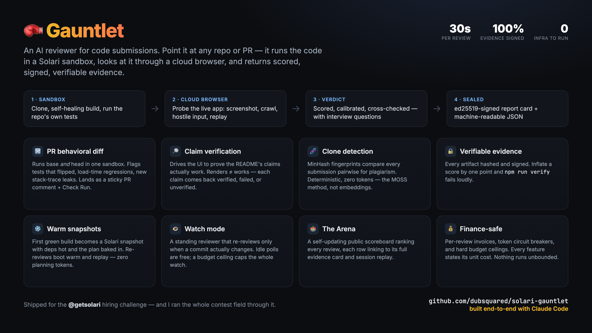

# Gauntlet



**An AI reviewer for code submissions, built on [Solari](https://getsolari.com).**

**🏟 Live scoreboard: [dubsquared.github.io/solari-gauntlet](https://dubsquared.github.io/solari-gauntlet/)** — every review, ranked, each row linking to its full evidence card and session replay.

Point Gauntlet at any GitHub repo or pull request. It clones the repo into a
fresh Solari sandbox, has Claude figure out how to install and run it (and
replan when a build breaks), runs the repo's own tests, exposes a web app on a
public preview URL and probes it through a Solari cloud browser — or launches a
GUI app on a Solari desktop — and writes a scored, signed review: does it run,
does it do what the README claims, is the code any good.

Built for a hiring challenge that promised *"we review every build that tags
us."* This is that reviewer. Every submission runs the gauntlet — including
the actual contest field: **[the live leaderboard](LEADERBOARD.md)** ranks
every public submission to the challenge, this repo among them, same rubric,
no special treatment.

Real output from a real run:

```console
$ npm start -- https://github.com/heroku/node-js-getting-started

▶ https://github.com/heroku/node-js-getting-started.git
  sandbox: ZGVza3RvcC1wb29sLWktMDZj…
  plan (attempt 1): Simple Express/EJS app, no DB or credentials needed; listens on PORT, binds all interfaces.
    $ npm install → exit 0
    $ npm test → tests PASS
    $ PORT=3000 node index.js (background, alive after 4s)
  preview: https://…preview.getsolari.com
  screenshot saved, title: "Node.js Getting Started on Heroku" (255ms to DOM)
  replay saved: 12 rrweb events
  ✔ 19/30 → reports/heroku-node-js-getting-started/report.md

batch: 1 reviewed, 0 failed · 74s · 10k tokens
```

## What it has reviewed

Every review below is committed in `reports/`, with screenshots, a session
replay where there is one, and a signed evidence manifest. Scores are
point-in-time and the rubric has tightened over the project's life, so the
[live Arena](https://dubsquared.github.io/solari-gauntlet/) is the source of
truth for current numbers.

**Real production code**

- [teslamotors/vehicle-command → 24/30](reports/teslamotors-vehicle-command/report.md)
  — the highest score to date. Gauntlet installed a Go toolchain itself
  through three self-healing replans, built the project clean, and ran the
  full test suite across roughly a dozen packages, all green. Its interview
  questions cite the real ECDH and Schnorr session code. It also flagged the
  tree as an exact match for the upstream repo — correct, because it is —
  which is the authenticity check working as designed.
- [ruvnet/ruv-FANN → 17/30](reports/ruvnet-ruv-FANN/report.md)
  — a Rust neural-network library. Gauntlet stood up a Rust toolchain, built
  the core crate clean in release mode, and ran its suite: 173 tests, 0
  failures. The README's swarm and forecasting claims couldn't be verified
  from a core-crate build, so those scored low, and two "secret pattern"
  hits on agent role-definition docs were reported as worth clarifying with
  the maintainer rather than as findings.
- [teslamotors/light-show → 14/30](reports/teslamotors-light-show/report.md)
  — a data repo with one runnable script. The script hung three times; the
  cause was `validator.py` calling `input()` even on success, so it blocks
  forever when run non-interactively. Gauntlet killed the hang, diagnosed
  it, retried with piped stdin, finished the review, and wrote the defect up
  as a finding.

**The contest field** — every public submission to the challenge, ranked in
[LEADERBOARD.md](LEADERBOARD.md), this repo included:

- [dubsquared/solari-gauntlet → 17/30](reports/dubsquared-solari-gauntlet/report.md)
  — yes, it reviewed itself. It couldn't observe its own pipeline live (no
  real API keys inside a reviewer's sandbox), so it refused to award "Runs"
  points on faith. Along the way the planner hit the sandbox's Node 18,
  diagnosed the engine mismatch, and upgraded Node inside the VM to keep
  going; it flagged the missing `engines` field, and that fix is committed.
  A reviewer that gives itself 30/30 is a reviewer you can't trust.
- Competitors at 16, 14, 14, and 12 — see the leaderboard for what each
  review observed.

**Fixtures and modes**

- [heroku/node-js-getting-started → 19/30](reports/heroku-node-js-getting-started/report.md)
  — stock boilerplate, scored as such; flags the orphaned `db.ejs`, the stock
  test file, and the Node engine mismatch.
- [mdn/beginner-html-site-styled → 19/30](reports/mdn-beginner-html-site-styled/report.md)
  — an unmodified tutorial clone, and the review says so.
- [techwithtim/Snake-Game → 15/30](reports/techwithtim-Snake-Game/report.md)
  — a **GUI** review on a Solari desktop. Vision saw the grid, snake, and
  food; computer-use verified "Right arrow moves the snake right" and
  correctly failed "Down arrow moves it down"; code quality was docked for
  real bugs in the source.
- [mdn/beginner-html-site-styled#114 → improvement](reports/mdn-beginner-html-site-styled-pr114/report.md)
  — a **PR behavioral-diff** review: base and head both built and probed in
  one sandbox, delta measured, before/after screenshots.

## Why this needs Solari

Running a stranger's code from the internet on your laptop is how you get
owned. Running it in a Solari **sandbox** — a microVM that boots from a
snapshot in about a second and is destroyed after the review — makes the scary
part free. The **port preview** makes the app publicly reachable without any
networking setup, and the **cloud browser** means the "does it actually
render?" check is a real Chromium looking at a real URL, not a curl and a
prayer. One Solari key for all the infrastructure, one Anthropic key for the
judgment, nothing to deploy.

## How it works

```
GitHub URL
   │
   ▼
┌─────────────────────────── Solari sandbox ───────────────────────────┐
│  git clone → security sweep → gather context (tree, README, source)  │
│  Claude plans install/run  ──►  execute  ──►  on failure, replan ↺   │
│  run the repo's own tests · web app? expose it on a preview URL      │
└──────────────────────────────────────────────────────────────────────┘
   │                                              │
   ▼ web                                          ▼ gui
┌──────────── Solari cloud browser ────────────┐ ┌──── Solari desktop ────┐
│  open the preview URL · title, text, console │ │  launch on X11         │
│  errors · crawl · hostile-input probe        │ │  screenshot the window │
│  screenshot · rrweb replay · claim checks    │ │  computer-use drives it│
└──────────────────────────────────────────────┘ └────────────────────────┘
   │                                              │
   ▼                                              ▼
Claude scores what actually happened → reports/<repo>/ (signed)
```

Beyond run-and-screenshot, every review also:

- **runs the submission's own test suite** and prints the transcript — the
  single highest-trust signal per engineering-hour, and it's deterministic;
- **records the whole browser probe** as an rrweb replay
  (`replay.ndjson`, committed next to the report) — when a candidate says
  "it worked for me," the dispute ends in thirty seconds;
- **sweeps for trouble before any repo code executes**: secret-pattern scan
  and a lockfile-only `npm audit` (no scripts run);
- **walks beyond the front door**: same-origin pages visited with per-page
  console-error counts, landing-page load time, and a mobile-viewport
  screenshot;
- **checks the README's claims by driving the app** (`--verify-claims`):
  Claude extracts up to three concrete UI claims and emits a bounded,
  whitelisted action script (navigate / click / fill / assertText — validated
  in code, hard 10-step cap, 10s per step, same-origin only) that the cloud
  browser executes live. Each claim comes back **verified / failed /
  unverified** — the difference between "it renders" and "it works" — and the
  checks happen while the session is recording, so they're in the replay.
  **For GUI submissions the same flag drives the desktop** via computer-use:
  Claude reads coordinates off the live screenshot, clicks and types in the
  window (≤2 claims, ≤6 clamped actions each), and a vision call judges the
  before/after frames — e.g. it verified "Right arrow moves the snake right"
  and correctly *failed* "Down arrow moves it down" on a pygame game;
- **generates three interview questions** grounded in the specific code —
  built to distinguish "wrote it and understands it" from "generated it and
  shipped";
- **accounts for itself**: wall time and token spend on every report,
  machine-readable `verdict.json` and `invoice.json` beside every
  `report.md`, a per-review token circuit breaker, and an append-only
  `reports/ledger.ndjson` tracking every repo's score, load time, and test
  status across re-reviews;
- **ships a shareable report card**: a self-contained `report.html` per
  review — scores, evidence, screenshots, and the **session replay embedded
  with a player**. Send one file; the whole review travels with it;
- **signs its verdicts**: the evidence manifest is ed25519-signed, and
  `npm run verify -- reports/<slug>` recomputes every hash and validates the
  signature. Inflate a score by one point and verification fails loudly;
- **shows the redemption arc**: re-reviewing a repo prints the score delta
  (▲/▼ vs last time) in the report, the card, and the ledger.

Three things make it an agent rather than a script:

- **Self-healing builds.** When `npm ci` fails on a lockfile or a Python app
  is missing a system package, the failing command's output goes back to
  Claude, which produces a corrected plan. Three strikes and the failure
  itself gets judged.
- **Evidence-based verdicts.** The reviewer model never sees the repo alone —
  it sees the executed commands with exit codes, the server log, the rendered
  page text, and the console errors. It grades what ran, not what was
  promised.
- **CLI submissions work too.** Not everything serves a port; a repo that
  prints its result is captured and judged the same way.

## Run it

```bash
git clone https://github.com/dubsquared/solari-gauntlet.git
cd solari-gauntlet
npm install

export SOLARI_API_KEY=slr_live_...      # console.getsolari.com
export ANTHROPIC_API_KEY=sk-ant-...     # console.anthropic.com

npm run smoke                        # verifies the Solari half alone — no Anthropic key needed
npm run selftest                     # commands DESIGNED to fail — asserts the harness reports them honestly
npm start -- https://github.com/heroku/node-js-getting-started
```

Reports land in `reports/<owner>-<repo>/` as markdown with the screenshot
embedded. Pass several URLs and you also get `reports/index.md` — a ranked
table across the batch, which is the artifact a hiring reviewer actually
opens. Submissions that live on a branch or in a subdirectory work as-is:
`.../tree/<branch>/<path>` URLs are understood.

Batch controls, tuned for a finance sign-off:

- `--concurrency N` — parallel reviews (Solari Starter allows 2 concurrent
  sandboxes; two reviews finish in about the wall time of one).
- `--budget-tokens N` (or `GAUNTLET_MAX_TOKENS`) — hard ceiling on Anthropic
  tokens for the whole batch. Crossing it skips the remaining repos loudly
  and exits nonzero; nothing is ever reviewed on a blown budget.
- `GAUNTLET_MAX_TOKENS_PER_REVIEW` (default 40000) — a per-review circuit
  breaker that stops further replans once one review has spent that much.
- `GAUNTLET_DISK_GB` — a bigger sandbox disk for heavy repos; a Rust release
  build or a many-package monorepo can fill the default and fail with
  ENOSPC, an environment failure that would otherwise read as the code's.
- Every report carries its own wall-time + token cost line, and the batch
  prints a totals line at the end.
- `GAUNTLET_MODEL` overrides the reviewer model (default `claude-sonnet-5`).

## What each Solari product does here

| Product | Used for |
| --- | --- |
| Sandbox | Clone + build + run untrusted code in a disposable microVM |
| Port preview | Make the sandboxed server publicly reachable, zero config |
| Cloud browser | Render the app for real: title, text, console errors, screenshot |
| Desktop | Run GUI submissions on a real X11 screen and screenshot the window |
| Session recording | The probe's full DOM-level replay, committed as audit evidence |

Gauntlet is the rare tool that exercises **all three** Solari surfaces — a web
app goes to the cloud browser, code goes to the sandbox, and a **GUI** goes to
a desktop.

## What shipped, and what's still on the roadmap

Every feature below came out of one of three multi-agent reviews — a 15-agent
adversarial hardening pass, a seven-persona stakeholder panel, and a
six-persona focus group — and was verified against the real Solari API.
Shipped:

- **PR behavioral-diff mode** — give it a pull-request URL
  (`.../pull/123`) and it clones once, fetches both sides (fork-safe), runs
  base *and* head in one sandbox, and reviews the *delta*: a table of build
  status, tests that flipped, load time, console errors, and stack-trace
  leaks — measured, not claimed — plus a Claude assessment of
  improvement / regression / neutral / mixed and before/after
  screenshots and replays. Evidence no static reviewer (Copilot,
  CodeRabbit) can produce. Wire it to PRs with the
  [example workflow](examples/gauntlet-pr-review.yml).

- **Self-updating PR comment** — with `--pr-comment` (or `pr-comment: true`
  in the Action), the behavioral-diff verdict is posted as one sticky comment
  on the PR, keyed by a hidden marker so it edits itself on each push instead
  of spamming the thread. `--dry-run-comment` renders it to stdout without
  posting. Needs a `GITHUB_TOKEN` with pull-request write.

- **GitHub Check Run** — with `--pr-check` (or `pr-check: true`), the diff
  verdict is published as a first-class check on the head commit.
  Conclusion is **advisory by default** — improvement/neutral pass,
  regression/mixed report `neutral`, *nothing fails a merge* — so it
  survives an org rollout. `--strict-check` opts into failing regressions
  for teams that want a hard gate. Needs `checks: write`.

- **Snapshot-warmed environments** (`--warm`, opt-in) — the first green build
  of a repo is checkpointed as a Solari snapshot with dependencies hot *and
  the known-good run plan baked inside it*. A later `--warm` review of the
  same repo boots from that snapshot, syncs to the target commit, and
  **replays the cached plan — zero planning tokens, no replan guesswork**.
  It's a pure optimization: any warm miss (a dropped control channel after
  restore, a sync error) discards that VM and cold-boots clean, so warm-start
  can never fail or corrupt a review — only ever make it a little slower.
  Snapshots are keyed by repo + lockfile hash and LRU-evicted (newest 2 per
  repo). Biggest win on repos with a heavy, stable dependency install that
  you re-review often; for trivial static repos the boot overhead can make it
  a wash, which is why it's off by default.

- **Watch mode** (`--watch`) — a standing reviewer. It polls each target's
  commit SHA every `--interval` seconds (floor 60, default 300) and
  re-reviews **only when the SHA changes** — an idle poll is a single free
  GitHub call, so spend tracks real activity, not wall-clock. Pairs naturally
  with `--warm` (same repo, over and over) and honors `--budget-tokens` as a
  cumulative ceiling that stops the whole watch, so it can never run unbounded.
  Works on repo and PR targets; rebuilds the Arena after every new review.
- **Cross-batch clone detection** (`npm run similarity`) — every repo review
  captures a MinHash structural fingerprint over its source k-shingles (the
  MOSS/JPlag method), and this compares them pairwise, flagging notable
  overlap (≥40%) and likely clones (≥80%) in `reports/similarity.md`. It's
  fully deterministic — **no embeddings, no new provider, zero tokens, no
  per-comparison cost** — which is the only kind of similarity search a
  finance team signs off on. Similarity ≠ plagiarism (a shared framework or a
  common template raises the score legitimately), so a flag is a prompt to
  look, not a verdict. The detector is proven to fire (a pristine fork scores
  100%); on the committed contest field it correctly reports no clones.
- **Gauntlet Arena** (`npm run arena`) — a single self-updating scoreboard,
  `reports/arena.html`, ranking every repo review and listing every PR
  verdict, each row linking to the full evidence card. Pure render from the
  committed `verdict.json` files: no sandbox, no API, no tokens. Rebuilt
  automatically after any batch or watch review.

- **Desktop / GUI review** — the planner emits `kind: "gui"` for submissions
  whose deliverable is a window (Electron, Tkinter, PyQt, pygame, a game).
  Gauntlet boots a Solari desktop, builds and launches the app on a real X11
  display, screenshots the screen, and Claude **vision** judges what actually
  rendered. Verified live on a pygame snake game.
- **Failure-mode probe** — a missing route and a malformed JSON POST, with
  status codes and stack-trace leaks recorded. "Does it survive hostile
  input" is the senior-vs-tutorial filter.
- **Harness self-test** (`npm run selftest`) — commands designed to fail the
  sneaky ways (a failing pipeline behind `| tail`, a stdin hang, `source`
  under a non-bash shell, exports that used to vanish between steps),
  asserting the harness reports each one honestly. Every case is a bug that
  shipped once.

Still on the roadmap, from the same reviews:

- **Network egress monitor** — log what the submission talks to during
  install and run; a hiring submission phoning home is a finding.
- **Org-level spend ledger** — monthly token and sandbox-minute envelopes with
  threshold alerts, so "on every PR in the org" has a number attached.
- **Human-gated rubric calibration** — learn from reviewer overrides without
  letting the model tune itself unsupervised.

## Reviewing hostile code, on purpose

Every input to this tool is untrusted by definition, so the design assumes
the submission is malicious:

- **The repo runs remotely, never here.** Clone, install, and execution all
  happen in a disposable Solari microVM that is killed after the review. No
  API keys are ever exported into the sandbox.
- **The repo URL is parsed, not interpolated.** Only
  `https://github.com/<owner>/<repo>`, a `/tree/<branch>/<path>` deep link, or
  a `/pull/<n>` URL passes validation, and the clone goes through argv
  (`git clone -- <url>`), so neither shell metacharacters nor git option
  injection reach a shell.
- **Repo-derived text is fenced off in prompts.** Everything the submission
  controls (README, file tree, build output, rendered page text, console
  errors) reaches Claude inside `<untrusted_submission_content>` tags that
  every prompt is instructed to treat as data — and to report as a red flag
  if it tries to give instructions.
- **Integrity claims clear the highest bar.** A suggestive word in repo text
  (fabricate, stub, scorecard) is never turned into an accusation: such text
  is at least as likely to be fixing the problem as committing it. The
  planner and the verdict must quote it with its surrounding purpose and,
  when intent is ambiguous, call it "worth clarifying with the maintainer" —
  never an "admission" — and it cannot move the scores. A false accusation
  is worse than a missed one.
- **Scores get a deterministic cross-check.** A verdict claiming a clean run
  that the step transcript contradicts — or suspiciously perfect scores —
  marks the report *flagged for manual review*. Prompt injection against
  LLM reviewers can be mitigated, not eliminated; the flag is the backstop,
  and reports never pretend otherwise.
- **Reports sanitize what they quote.** Preview access tokens, ANSI escape
  sequences, and code-fence breakouts are stripped before anything the
  submission produced lands in a committed markdown file.
- **The readiness poll can't be steered.** The host-side health check uses
  `redirect: "manual"` with a per-request timeout, so a hostile server can't
  bounce this machine into internal endpoints (blind-GET SSRF). The actual
  page rendering happens in Solari's cloud browser, not here.

## Honest limitations

- Reviews run sequentially by default; `--concurrency N` parallelizes up to
  your plan's sandbox limit, at the cost of interleaved console output.
- A malicious repo can't escape the sandbox, but it can waste sandbox
  minutes: each step is capped at five minutes and the VM at a ten-minute
  idle window, and that's the ceiling, not zero.
- Prompt injection defenses reduce risk; they don't zero it. The
  flagged-for-review mechanism exists because a sufficiently clever
  submission may still nudge a score.
- The verdict can misread intent. It once turned a repo's own audit and
  hardening work — an ADR removing fabricated metrics — into an accusation
  of fabricating them. That review was caught before publication and a
  guardrail now forbids the framing, but it reduces the risk rather than
  removing it: read the cited lines yourself before publishing any
  integrity concern about someone's work.
- Some repos can't be judged fairly from a sandbox at all — anything that
  needs live credentials, Docker, a GPU, or a very large build. Those cap
  "Runs" by design, and a low score there means "unverified," not "bad."
- The 0–10 scores are an LLM's judgment, calibrated by rubric anchors and
  grounded in source excerpts the model actually reads. They rank a pile of
  submissions well; they are not a substitute for reading the finalists.

MIT licensed.
