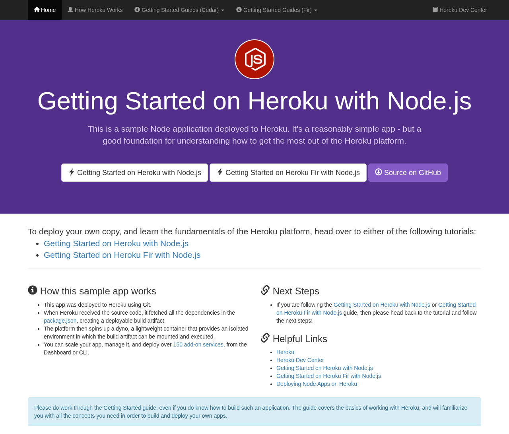

# Gauntlet review — https://github.com/heroku/node-js-getting-started.git

**20/30** · reviewed 2026-09-02 at `63c6674` · ran as `web`

| Dimension | Score | |
| --- | --- | --- |
| Runs | 8/10 | `████████░░` |
| Delivers its claims | 7/10 | `███████░░░` |
| Code quality | 5/10 | `█████░░░░░` |

The app is the standard Heroku Node.js getting-started template and it does run cleanly, with the live page matching the README's described homepage content. However, there is little evidence of custom implementation work beyond the boilerplate, an unused db.ejs view suggests incomplete features, and code quality can't be rated highly given the minimal excerpts and unverified test suite. Engine version warnings during install indicate some environment friction, though the app still started successfully.

## Strengths
- App started and served correctly on the specified port with no console errors
- Live-rendered homepage content matches the README's described 'Getting Started on Heroku with Node.js' page
- Clean, minimal Express + EJS setup with graceful SIGTERM handling and keep-alive tuning matching Heroku's routing recommendations

## Concerns
- This submission is essentially the stock heroku/node-js-getting-started boilerplate with no visible custom features or challenge-specific logic
- views/pages/db.ejs exists in the tree but no corresponding /db route appears in the shown index.js, suggesting incomplete or orphaned functionality
- npm install produced an EBADENGINE warning (Node 18 installed vs required 22.x/24.x/26.x) plus 3 audit vulnerabilities, indicating environment/dependency friction not fully resolved
- test.js is present but its contents and whether tests actually pass were not shown/verified
- Source excerpts are very thin (only index.js shown in full); insufficient evidence of error handling, input validation, or test coverage to judge code quality highly

## How it was run
> Simple Express app; index.js listens on PORT env var, no DB/keys required for root route

```console
$ cd /home/user/repo && npm install   # exit 0
$ PORT=3000 npm start   # exit 0
```

## Live probe
Opened `https://dd8c5e8457c46bdc92eb-3000.preview.getsolari.com` in a Solari cloud browser.

- title: "Node.js Getting Started on Heroku"
- console errors: none


