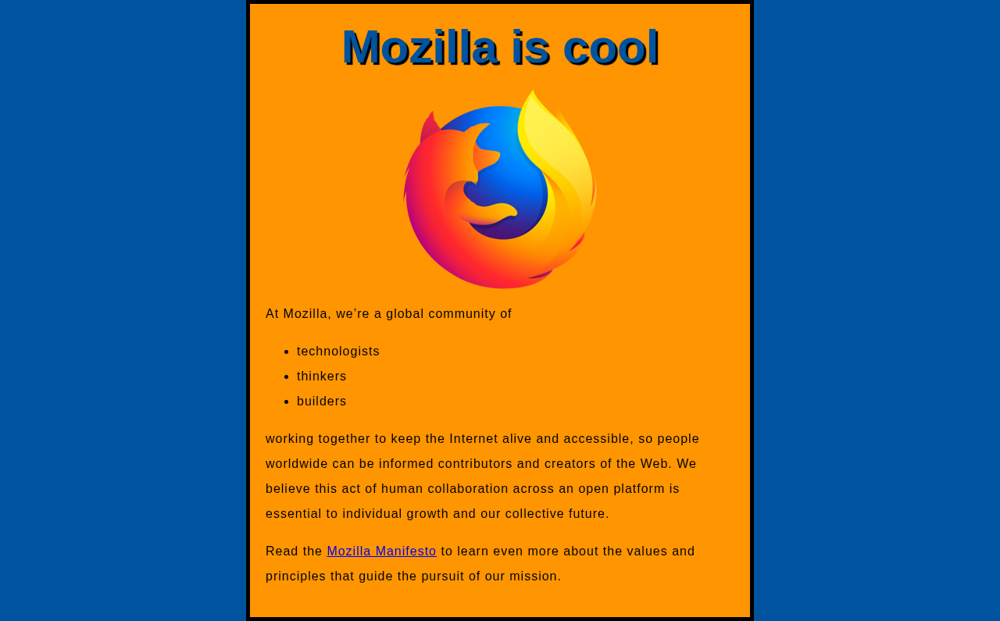

# Gauntlet PR review — mdn/beginner-html-site-styled#114

🟢 **IMPROVEMENT** · Added rel attribute to external link for security.

`main` @ bf7d481 → `sreejadandu-patch-1` @ c3e3de8 · 96s · ~4k tokens · advisory, not a merge gate

This PR adds rel="noopener noreferrer" and target="_blank" to an external link pointing to the Mozilla Manifesto page in a simple static HTML file. The change is minimal, isolated to a single line, and the deterministic delta table confirms no regressions: build still succeeds, no new console errors, no hostile leaks, and the probe still passes. The small increase in loadMs (121 to 162) is negligible and likely noise given the trivial nature of the change. This is a small, well-targeted security/best-practice improvement with no observed downsides.

## Measured, not claimed

| | base | head |
| --- | --- | --- |
| Build | ✅ | ✅ |
| Own tests | none found | none found |
| Landing DOM load | 121ms | 162ms |
| Console errors | 2 | 2 |
| Stack-trace leaks under hostile input | 0 | 0 |
| Live probe | ✅ | ✅ |

## Improvements
- Adding rel="noopener noreferrer" to an external link with target="_blank" prevents potential reverse tabnabbing attacks, a recognized security best practice.
- target="_blank" improves UX by opening external links in a new tab, keeping the main site open.

## Concerns
- The loadMs increased from 121 to 162, though this is likely noise given the trivial single-attribute change and no other observable behavioral difference.
- No functional tests exist for this repo (testsPass is null), so verification relies solely on manual diff review and basic probes.

### base — what the cloud browser saw

### head — what the cloud browser saw

---
Both sides ran in one disposable Solari sandbox; the browser evidence is a
real Chromium on a public preview URL. Evidence sealed and ed25519-signed
in [`manifest.json`](manifest.json) — `npm run verify` proves integrity.
