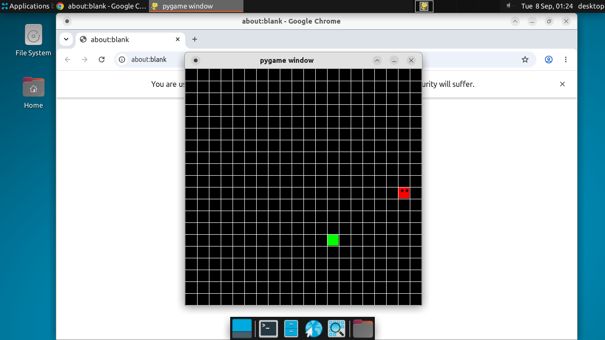

# Gauntlet review — https://github.com/techwithtim/Snake-Game.git

**18/30** · reviewed 2026-09-08 at `4965f76` · ran as `gui` · 39s · ~10k tokens

| Dimension | Score | |
| --- | --- | --- |
| Runs | 8/10 | `████████░░` |
| Delivers its claims | 6/10 | `██████░░░░` |
| Code quality | 4/10 | `████░░░░░░` |

The snake game launched successfully after installing pygame and SDL dependencies, and the live screenshot shows a rendered grid with head and food cubes, confirming basic functionality. However, the visible code has notable bugs (mutable class-level state, incomplete QUIT handling) and the excerpt cuts off before critical logic like collision and food-respawn, so full correctness can't be verified. No test suite exists, and the README includes irrelevant promotional content, both of which weigh against code quality and rigor.

## Strengths
- App launched cleanly after installing SDL/pygame dependencies and rendered a live grid with a red 'snake head with eyes' cube and a green food cube, matching the classic snake game concept from the README
- Simple, readable class structure (cube, snake) separating rendering from movement logic
- requirements.txt and .gitpod.yml suggest at least minimal attention to reproducible setup

## Concerns
- Only a single starting cube is visible with no visible trailing body segments in the screenshot, so it's unclear if growth/collision/game-over logic actually works as advertised — no gameplay interaction was verified beyond the initial render
- Source excerpt is truncated mid-function (addCube), so full game logic (collision detection, food respawn, score, game-over handling) cannot be verified from what was shown
- No automated test suite exists at all, and none was run — codeQuality cannot be confirmed beyond static reading of a partial file
- Uses tkinter for message boxes alongside pygame's own event loop, which is a somewhat fragile/dated approach (mixing two GUI toolkinks) and could cause platform-specific issues
- The move() method calls pygame.quit() on QUIT event but does not break out of the loop or exit the process, which is a bug (window would linger)
- Class attributes 'body' and 'turns' declared at class level in snake class are mutable shared state across instances — a classic Python bug (all snake instances would share the same list/dict) that suggests limited testing of edge cases
- README contains promotional/marketing content for an unrelated paid program, an unusual and slightly concerning addition unrelated to the technical submission

## How it was run
> Pygame desktop snake game requiring a display; no server or tests; README promo content ignored as red-flag marketing, not instructions.

```console
$ git clone   # exit 0
$ cd /tmp/gauntlet-repo && apt-get update -y   # exit 0
$ cd /tmp/gauntlet-repo && apt-get install -y python3-pip python3-tk libsdl2-2.0-0 libsdl2-image-2.0-0 libsdl2-mixer-2.0-0 libsdl2-ttf-2.0-0   # exit 0
$ cd /tmp/gauntlet-repo && pip3 install pygame   # exit 0
$ python3 snake.py   # exit 0
$ gui log   # exit 0
```

## The submission's own tests
No test command found — a fact the score reflects.

## Security sweep
- dependency audit: n/a (no lockfile)
- secret patterns: no matches

## Live GUI
Launched on a Solari desktop (X11 + VNC) and screenshotted — the verdict's scores are judged from what the window actually rendered.



```console
$ git clone (exit 0)
$ cd /tmp/gauntlet-repo && apt-get update -y (exit 0)
$ cd /tmp/gauntlet-repo && apt-get install -y python3-pip python3-tk libsdl2-2.0-0 libsdl2-image-2.0-0 libsdl2-mixer-2.0-0 libsdl2-ttf-2.0-0 (exit 0)
$ cd /tmp/gauntlet-repo && pip3 install pygame (exit 0)
$ python3 snake.py (exit 0)
$ gui log (exit 0)
```

## Ask the candidate
1. In the snake class, 'body' and 'turns' are defined as class attributes rather than instance attributes in __init__ — what bug does this cause if you create two snake instances, and how would you fix it?
2. Your move() method calls pygame.quit() on a QUIT event but doesn't break the loop or exit the process — what happens in practice, and how would you handle a full clean shutdown?
3. Walk through your collision detection and food-respawn logic (not shown in the excerpt) — how do you prevent food spawning on the snake's body, and how do you detect self-collision reliably?

---
Evidence sealed: [`manifest.json`](manifest.json) carries a SHA-256 for every
artifact in this directory, ed25519-signed. `npm run verify -- <this dir>`
proves nothing changed since the review.
